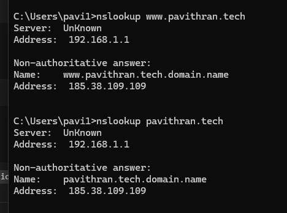
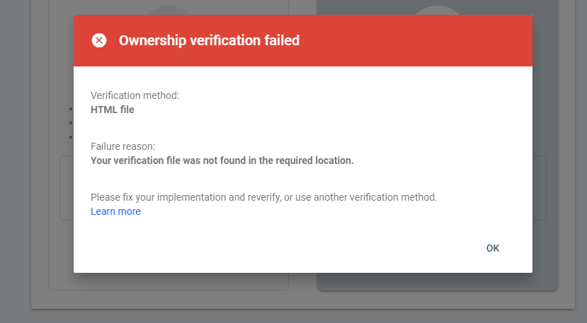

# 🌐 Pavithran.tech - Domain Setup Journey (Visual Log)

**Goal:**  
Set up a custom domain for my GitHub Pages portfolio, secure it with HTTPS, and prepare it for SEO and Google Search Console verification.

---

## 🗓 Timeline & Steps

### 1. Domain Purchase
- **Date:** YYYY-MM-DD
- **Action:** Purchased `pavithran.tech` from [Domain Registrar Name].
- **Reason:** Build a personal tech portfolio and brand.
- **Note:** `.tech` was chosen for its direct connection to the tech field.

---

### 2. Connecting Domain to GitHub Pages
- **Repository:** `Pavithran-P12/pavithran-p12.github.io`
- **Steps Taken:**
  1. Went to **GitHub → Repo → Settings → Pages**.
  2. Entered `pavithran.tech` in **Custom domain**.
  3. Configured DNS records:

     ```
     A     185.199.108.153
     A     185.199.109.153
     A     185.199.110.153
     A     185.199.111.153
     CNAME www → pavithran-p12.github.io
     ```

---

### 3. First Hurdle — DNS Conflict
**Error Seen:**
> `Record name www conflicts with another record`

**Screenshot:**  


**Cause:**  
Existing `A` record for `www` clashed with the new required `CNAME`.

**Fix Applied:**
- Deleted `www` A record.
- Added correct CNAME pointing to `pavithran-p12.github.io`.

---

### 4. GitHub Pages Error — Domain Not Served
**Error Seen:**
> `NotServedByPagesError`  
> *Both pavithran.tech and its alternate name are improperly configured*

**Screenshot:**  


**Cause:**  
DNS changes had not propagated fully.

**Fix Applied:**  
- Confirmed A & CNAME records matched GitHub’s docs.
- Waited several hours for DNS propagation.

---

### 5. Google Search Console — Verification Failed
**Error Seen:**  
> `Ownership verification failed`  

**Screenshot:**  


**Cause:**  
HTML file verification failed because GitHub Pages didn’t serve the uploaded file from root.

**Next Attempt Planned:**  
- Use **HTML `<meta>` tag** or **DNS TXT record** method after HTTPS is active.

---

### 6. HTTPS Certificate Delay
**Status:**  
- GitHub Pages HTTPS toggle disabled.
- SSL certificate still pending issuance.

**Cause:**  
SSL requires DNS to fully propagate before certificate generation.

**Screenshot:**  


**Next Step:**  
- Wait 24–48 hours.
- Enable **Enforce HTTPS** once available.

---

### 7. SEO Preparation
- Created `sitemap.xml`.
- Plan: Submit sitemap to Google Search Console after verification.
- Will add meta tags for SEO optimization in portfolio README.

---

## ✅ Next Actions
1. Wait for DNS propagation & HTTPS certificate issuance.
2. Enable **Enforce HTTPS**.
3. Re-verify domain in Google Search Console using DNS TXT record.
4. Submit `sitemap.xml` and request indexing.
5. Monitor Google Search visibility.

---

**📅 Target Completion:** YYYY-MM-DD  
**🏆 Milestone:**  
- Domain live with HTTPS.  
- Search engine verified & indexed.  
- Portfolio optimized for SEO.
